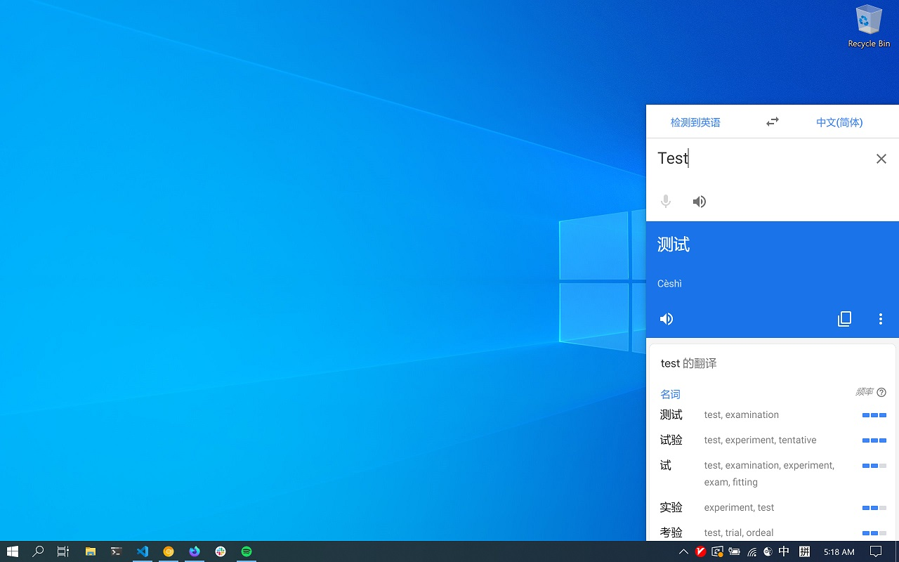

# Goolge Translate
<p align="center">
  <a href="https://github.com/mantou132/GoogleTranslate/releases"></a>
  <a href="https://travis-ci.org/mantou132/GoogleTranslate"></a>
  <a href="./LICENSE"></a>
  <a href="https://github.com/prettier/prettier"></a>
</p>


## 使用方式

- 安装浏览器[扩展](https://github.com/mantou132/CallGoogleTranslate)，在浏览器中选择文本，使用上下文菜单进行翻译
- 在任意应用中选择文本，默认使用 <kbd>command/ctrl</kbd> + <kbd>q</kbd> 进行翻译
- 在窗口内使用快捷键：<br>
  <kbd>esc</kbd> - 关闭窗口<br>
  <kbd>enter</kbd> - Google 翻译页面聚焦到输入框<br>
  <kbd>command</kbd> + <kbd>1</kbd> - 朗读源文本<br>
  <kbd>command</kbd> + <kbd>2</kbd> - 朗读翻译文本<br>
  <kbd>command</kbd> + <kbd>3</kbd> - 复制翻译文本<br>
  <kbd>command</kbd> + <kbd>s</kbd> - 保存/撤销保存翻译<br>
  <kbd>command</kbd> + <kbd>i</kbd> - 登陆 Google 账号<br>
  <kbd>command</kbd> + <kbd>o</kbd> - 登出 Google 账号<br>
  <kbd>command</kbd> + <kbd>shift</kbd> + <kbd>w</kbd> 连续按两次 - 退出应用

## 下载

您可以在[这里](https://github.com/mantou132/GoogleTranslate/releases/latest)手动下载最新版本

## FAQ

Q：MacOS 下为什么 <kbd>command</kbd> + <kbd>q</kbd> 打开翻译窗口没有自动填充选择的文本？<br>
A：可能被 OS 禁止了，试试重新为应用授权。如：<a href="./screenshot/macos-preference.png">图片</a>

## 开发

```bash
# 同步子模块
git submodule update --remote --init
# 安装 rust 环境

# 安装项目依赖
pnpm i
# 将 ts 转成 js
pnpm run watch
# 以开发模式启动项目
pnpm start
```

如有网络问题不能 `build`, 可以为 `npm` 设置代理：

```bash
# 如果只有 socks 代理，需要将 socks 代理转成 http 代理
# https://www.npmjs.com/package/http-proxy-to-socks
hpts -s 127.0.0.1:10808 -p 1080

pnpm config set proxy http://127.0.0.1:1080
pnpm run build
pnpm config delete proxy
```

## TODO

- 翻译指针位置的单词
